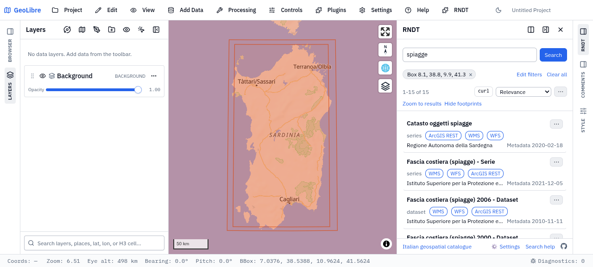

# openrndt-geolibre

**Find Italy's maps and spatial data, and put them on the map with a click.**

Regions, municipalities, ministries and agencies publish their maps in one national catalogue, the **RNDT** ([Repertorio Nazionale dei Dati Territoriali](https://geodati.gov.it/geoportale/)): rivers, beaches, landslides, cadastral parcels, aerial photos, hiking trails, more than 23,000 records in all. This plugin brings that catalogue into [GeoLibre](https://github.com/opengeos/GeoLibre), the free GIS that runs in the browser and on the desktop: search it as you would with a search engine, see on the map where each dataset lies, and add its layers without copying a single address.



Status: **beta**, open for testing. It is in the [GeoLibre plugin registry](https://plugins.geolibre.app/catalog/openrndt-geolibre/).

## Try it now, in your browser

Nothing to install. Each link opens [GeoLibre web](https://web.geolibre.app/); the first time it asks whether to load the plugin (**Trust and load**), then runs the search. The examples go from a single word to something you can only do with a desktop GIS.

### 1. One word

[Rivers, streams and water, all over Italy](https://web.geolibre.app/?plugin=openrndt-geolibre&rndt=idrografia): over a thousand records for `idrografia`. Every result is drawn on the map as the area it covers. Hover a card and its area lights up on the map; hover an area and its card lights up in the list.

### 2. A place

[The beaches of Sardinia](https://web.geolibre.app/?plugin=openrndt-geolibre&rndt=spiagge&rndtBbox=8.1,38.8,9.9,41.3): the same kind of search, limited to an area. In the panel the area can be the current map view, a box you type, or shapes you draw on the map.

### 3. A few filters

[Landslides: data only, open data, ready to view as WMS](https://web.geolibre.app/?plugin=openrndt-geolibre&rndt=frane&rndtKind=data&rndtAs=WMS&rndtOpen=1): each filter is a chip above the results, and a click on its × removes it. There are more: INSPIRE theme, keywords, organisation, dates, sort order. **Search help** in the panel explains each one with examples you can click.

### 4. One record, live data

[Florence tramway, today's worksites](https://web.geolibre.app/?plugin=openrndt-geolibre&rndt=c_d612:tramvia-cantieri-321-odierna:1&rndtBbox=11.15,43.73,11.35,43.82): a link can open a single record, and move the map to a place. This one is a dataset the Comune di Firenze updates every day. Choose **Add to map** next to its download link: the worksites open today appear on the map, converted on the fly from the old Italian coordinate system (Gauss-Boaga) the file is in.

### 5. In GeoLibre Desktop: the cadastral map of any municipality

The cadastral maps of Italian municipalities, published by the Agenzia delle Entrate, are in the catalogue. In the panel search `Cartografia catastale Pollina` (or any other municipality), open the record, tick `Particelle` and add it. Turn on GeoLibre's **Identify** and click a parcel: you get its cadastral reference, such as `G797_001500.14`. This one needs GeoLibre Desktop: the service does not offer the projection web maps use, and only Desktop redraws its images in that projection.

### 6. Keep it, share it, hand it to an AI agent

- **Share**, in the ⋯ menu of the results or of a record, builds a link like the ones above for the search on screen, and hands it to your system's share sheet (mail, WhatsApp, Teams…), or copies it.
- **Save the project**: the search goes into it, with the record you had open. Whoever opens the file finds the same search, run again on today's catalogue.
- **Copy for an agent**, in the ⋯ menu of the results, copies the search as Markdown, with the filters in words, the records as a table and a ready `curl` request: paste it into an AI assistant and go on from there with [openrndt](#openrndt-the-same-catalogue-from-the-command-line).

## What else it does

- **Any kind of service**: WMS layers are added as images, named with their titles; WFS and ArcGIS REST layers can also be downloaded as features (GeoJSON); WFS features are drawn with the style the server gives, when it has one. A layer from a regional or municipal record is limited to that area, even when the service covers all of Italy.
- **Where each layer comes from**: WMS and ArcGIS image layers added from the panel carry the record it came from (catalogue, record id, organisation, link to the record's page), in GeoLibre's Metadata dialog.
- **Recent searches**: a click in the search box lists your last 20 searches; a click runs one again.
- **When a service does not answer**, the panel says why, in plain words (server gone, no CORS, an error from the server), and, when the server is at fault, **Copy error report** prepares an email for whoever publishes the data. **Contact** prepares one for any other request: a question on the data, its licence, an update.

The details are in the [wiki](wiki/index.md): [search](wiki/guides/search.md), [add layers](wiki/guides/add-layers.md), [share a search](wiki/guides/share-a-search.md), every [link parameter](wiki/reference/url-parameters.md).

## Install it in GeoLibre

You need [GeoLibre](https://github.com/opengeos/GeoLibre/releases) 3.3.0 or later.

1. In GeoLibre open **Settings > Manage Plugins**.
2. Find **RNDT catalogue** and choose **Install**.
3. Turn the plugin on from **Plugins > RNDT catalogue**.

When a new version reaches the registry, Manage Plugins offers an **Update**. To install from a zip, a version not in the registry yet, see [Install](wiki/guides/install.md).

## Good to know

- **Web or Desktop**: in the browser, a service can be shown only if its server allows it (CORS headers): many public servers do not, and the panel says so. GeoLibre Desktop reads services through its own client, not the browser, so they work there. A trick: search in the browser, save the project, open it in Desktop ([from web to Desktop](wiki/guides/web-to-desktop.md)).
- **Saving a search**: closing without saving loses the search without asking, since GeoLibre does not see it as a change ([why](wiki/limits/unsaved-search.md)).
- **Footprints in the wrong place**: the plugin draws the area each record declares. When the record is wrong, the area is too: all the records of one Tuscan municipality land in Ethiopia ([#13](https://github.com/ondata/openrndt-geolibre/issues/13)).
- **Some services cannot be added**: a WFS without GeoJSON output, ArcGIS services behind a login. The full list is in [Limits](wiki/limits/index.md).

## Report a problem or an idea

Open an [issue](https://github.com/ondata/openrndt-geolibre/issues/new/choose). For a problem, please include:

- GeoLibre version and operating system;
- what you searched and which record (its title, or the "Copy id" of the record);
- the error shown in the panel, and the lines of **Diagnostics** (bottom right in GeoLibre) about it;
- a screenshot, if it helps.

A service that fails is usually a problem of whoever publishes it: **Copy error report**, in the panel, is the way to tell them.

## openrndt, the same catalogue from the command line

[openrndt](https://github.com/ondata/openrndt) is a command line tool, and a Python library, for the same catalogue. The plugin is for looking: a map, the footprints, a layer added with a click. openrndt is for the work a panel does not do: many records at once as CSV or JSON, footprints as a GeoJSON file, one record in full, its services checked one by one. It is read-only and built to be driven by an AI agent, with an Agent Skill (`rndt-explorer`) in its repository.

```bash
uv tool install openrndt          # or, without installing: uvx openrndt --help
openrndt search --q "spiagge" --bbox 8.1,38.8,9.9,41.3 --num 10
openrndt resources age:D_G797_POLLINA
```

The two meet on the record id: **Copy id** in the panel gives the id that `openrndt get` and `openrndt resources` take, and an id typed in the panel's search box opens that record.

## Development

```bash
npm install
npm run build
npm test
npm run lint
```

How to try a build in GeoLibre Desktop and web, the layout of the source, and the release steps (here and in the plugin registry) are in the wiki, under [Development](wiki/development/index.md).

## License

MIT, Copyright (c) 2026 Andrea Borruso <andrea.borruso@ondata.it>. Started from the [GeoLibre plugin template](https://github.com/opengeos/geolibre-plugin-template) by Qiusheng Wu, also MIT: its notice stays in [LICENSE](LICENSE) for the parts that come from it.
