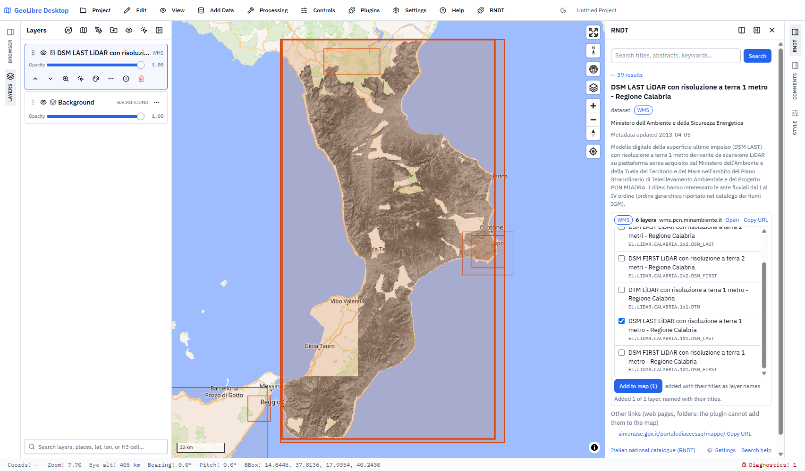

# openrndt-geolibre

A [GeoLibre](https://github.com/opengeos/GeoLibre) plugin to search the **RNDT** ([Repertorio Nazionale dei Dati Territoriali](https://geodati.gov.it/geoportale/), the Italian national catalogue of spatial data) and add its WMS and WFS services to the map.

It is the GeoLibre counterpart of the [openrndt](https://github.com/ondata/openrndt) CLI and uses the same RNDT REST API (`https://geodati.gov.it/RNDT/rest/metadata/search`).

Status: **alpha**, open for testing. Not yet in the GeoLibre plugin registry.



## Try it

You need [GeoLibre Desktop](https://github.com/opengeos/GeoLibre/releases) (tested with 3.1.0).

1. Download `openrndt-geolibre-<version>.zip` from the [latest release](https://github.com/ondata/openrndt-geolibre/releases).
2. In GeoLibre open Manage Plugins, go to Settings, choose **Install from file** and pick the zip.
3. Restart GeoLibre, then turn the plugin on from **Plugins > RNDT catalogue**.

Manual install, if you prefer: unzip into a folder named `openrndt-geolibre` inside GeoLibre's plugins folder, so that `plugin.json` and `dist/` sit directly in it, then restart GeoLibre.

| System | Plugins folder |
|---|---|
| Windows | `%APPDATA%\org.geolibre.desktop\plugins\` |
| macOS | `~/Library/Application Support/org.geolibre.desktop/plugins/` |
| Linux | `~/.local/share/org.geolibre.desktop/plugins/` |

## Report a problem or an idea

Open an [issue](https://github.com/ondata/openrndt-geolibre/issues/new/choose). For a problem, please include:

- GeoLibre version and operating system;
- what you searched and which record (its title, or the "Copy id" of the record);
- the error shown in the panel, and the lines of **Diagnostics** (bottom right in GeoLibre) about it;
- a screenshot, if it helps.

When a service fails, the panel offers **Copy error report**: a ready-to-paste email for the record's contact (with RNDT in copy) about a broken service. That is for the data publisher; problems of the plugin itself go in the issues here.

## What it does

- **Search**: free text, type (all, data, services), where (anywhere, current map view, shapes drawn with GeoEditor, a typed box; touching or inside the area), available as WMS/WFS. Advanced filters: match mode (all words, any word, Lucene), field, INSPIRE theme, keywords, organisation (show only or hide), open data only, dates (revision, publication, creation, added to catalogue), sort. "?" buttons and **Search help** explain each filter with clickable examples.
- **Results**: active filters as removable chips; pager, sort and a `curl` button that copies the query; cards with type, formats, organisation and metadata date; a ⋯ menu per card to hide or keep only its organisation. Footprints on the map, highlighted on hover in both directions; with overlapping footprints a click lets you choose.
- **Detail view**: a record opens in its own view with its abstract, services and links. WMS and WFS layers are listed as soon as it opens, with a readable name and the layer code. Tick one or more WMS layers and add them, named with their titles; for a WFS pick one feature type and download its features as GeoJSON (only in the current map view if you like; above 10,000 features the panel asks first).
- **Errors**: when a server is gone (its name is not in the DNS) the panel says so; **Copy error report** prepares an email for the record's contact.
- **Settings** (⚙ in the footer, off by default, stored on your computer only): log the service URLs that fail and export the log as JSON Lines.

## Known limits

- WMS layers not offered in `EPSG:3857` (for example the Agenzia delle Entrate cadastral WMS, `EPSG:6706` only) cannot be added: the GeoLibre plugin API has no `crs` option for `addWmsLayer` yet (proposed in opengeos/GeoLibre#2701). The panel says so.
- WFS services without a GeoJSON output format cannot be added.
- GeoLibre Desktop opens no `mailto:` link from a plugin, so the error report is copied to the clipboard instead of opening your mail client.
- Footprints are a temporary map overlay, not a project layer, and need the MapLibre renderer.

## Development

Building in WSL and testing in GeoLibre Desktop on Windows:

```bash
npm install
npm run build
P=/mnt/c/Users/<user>/AppData/Roaming/org.geolibre.desktop/plugins/openrndt-geolibre
mkdir -p "$P" && cp -r geolibre-plugin/plugin.json geolibre-plugin/dist "$P"/
```

Restart GeoLibre Desktop, then Plugins > RNDT catalogue. `npm run package:geolibre` writes the zip for Install from file (`geolibre-plugin/openrndt-geolibre-<version>.zip`).

```bash
npm test                                                # unit tests (no network)
RUN_LIVE_TESTS=1 npx vitest --run tests/live.test.ts    # compare query totals with the live catalogue
npm run lint
```

`src/geolibre.ts` is the plugin entry; the code lives in `src/rndt/`:

| File | Role |
|---|---|
| `query.ts` | search form to REST query (pure, tested against `tests/fixtures/queries.json`) |
| `records.ts` | parsing of search results, service links, contacts, footprints |
| `ogc.ts` | WMS/WFS GetCapabilities parsing, GetFeature URLs, axis-order fix |
| `layer-names.ts` | readable layer names from capabilities titles and RNDT records |
| `panel.ts`, `panel.css` | the panel UI (plain DOM, `ordt-` CSS prefix) |
| `footprints-layer.ts` | footprints overlay on the MapLibre map |
| `settings.ts` | plugin settings and the error log (localStorage) |
| `host.ts` | fetch helpers and host API methods beyond `src/lib/geolibre/host-api.ts` |

`tests/fixtures/queries.json` is meant as a shared test oracle with openrndt, which should build the same queries.

## License

MIT, Copyright (c) 2026 Andrea Borruso <andrea.borruso@ondata.it>. Started from the [GeoLibre plugin template](https://github.com/opengeos/geolibre-plugin-template) by Qiusheng Wu, also MIT: its notice stays in [LICENSE](LICENSE) for the parts that come from it.
